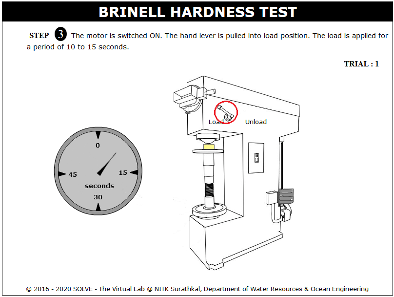

**OBJECTIVE**:

To determine the indentation hardness of,

1. Mild steel specimen
2. Cast iron specimen
3. Brass specimen
4. Aluminum specimen

**STEPS**:

1. When you click on a brinell test file, a new window will open as shown below.  
   

2. Click on the NEXT button at the bottom right corner to move to the next step.  
   

3. Click on the material to select the required specimens and the load to be applied on that is shown, and then click on NEXT button.  
   

4. The load to be applied on the selected specimen is displayed here, click NEXT button to mount the specimen on setup.  
   

5. Click on hand wheel then move mouse pointer over the hand wheel to rotate it in clockwise direction till the specimen is in position, after adjusting the specimen in specified position then move to the next step by clicking on NEXT button.  
   

6. Switch on the machine and click on hand lever to apply load, again click on unload after applying load of 10 to 15 sec for ferrous material and up to 30sec for nonferrous material.  
   

7. Scroll mouse over the microscope adjusting screw to view the indentation, adjust the indentation corner to zero.  
   

8. Click on hand lever again to stop the loading process.  
   

9. The observation of trial 1 is given; repeat the same steps for other trials.  
   

10. The final average hardness value from different trials is given here.  
    
