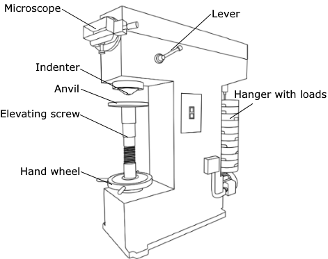
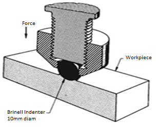
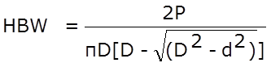
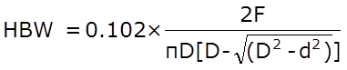
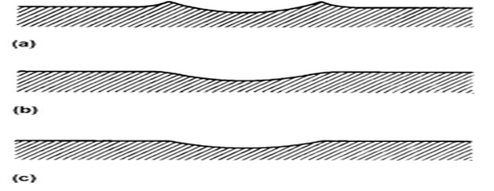

Brinell hardness test is most commonly used to test materials that have a structure that is too rough or too coarse to be tested using other test methods, e.g., castings and forgings. In brinell testing machine the load is applied by a lever mounted on knife edges and carrying a hanger for suspending the required load. The supporting table for spacing the specimen can be raised or lowered by a steel screw by operating a large hand wheel. When testing, the load is applied and removed by hydraulic power controlled by a hand lever. The indenter used is a hardened steel ball which will have a diameter of 10mm, 5mm or 2.5mm. The reading microscopic has a 25-fold magnification.The gap between successive graduations of the scale is 0.5mm and a micrometer is arranged sideways, the eye piece of the reading microscope may be turned up by 90 degree so that the impressions of the ball can be measured in two perpendicular directions.

Brinell testing often use a test load of 500Kg for relatively soft materials such as copper, aluminium alloys and 3000kgf for harder material and a 10mm wide indenter so that the resulting indentation averages out of most surface and sub-surface inconsistencies. After the load is applied for a specific time (usually 10 to 15 sec for hard ferrous materials and about 30 sec for soft nonferrous materials) the recovered indentation diameter is measured in millimetre. This time period is required to ensure that plastic flow of the work metal has ceased.

A well structured Brinell hardness number reveals the test conditions, i.e., "70 HB 10/500/30" which means that a Brinell Hardness of 70 was obtained using a 10mm diameter hardened steel ball with a 500 kilogram load applied for a period of 30 seconds. Highly hardened steel cannot be tested by a hardened steel ball because the ball will get flattened and become permanently deformed. The appreciable error in BHN occurs at indentation diameter less than 2.9mm and for softer materials inaccuracy is at diameter greater than 6mm. On tests of extremely hard metals a tungsten carbide ball is substituted for the steel ball (upto 444-627 HB) and a special hardened and burnished steel ball called the "Hulked" ball may be used up to 500 HB.

(showing the manner in which the application of force by the indenter causes the metal of work piece to flow)

Compared to the other hardness test methods, the indenter used in brinell makes the deepest and widest indentation, so that test averages the hardness over a wider amount of materials which will accounts for multiple grain structures and any irregularities in the uniformity of the material.

The Brinell hardness number is defined as the ratio of test load to the surface area of indentation.

Where,

P = Load in Kg

HBW = Brinell hardness number (Kg/mm2)

D = Diameter of the ball (mm)

d = Diameter of the indentation (mm)

Where,

Constant = 0.102 = 1/(g ) = 1/9.81

g = acceleration due to gravity

F = Force in Newton

While testing, the indentation should not be made nearer to the edge of a specimen, the distance from the edge to the centre of indentation should be greater than 2.5 times diameter of indentation in order to avoid unnecessary concentration of stresses the spacing between the two adjacent impressions should be at least 3 times the diameter of indentation, and also the rapid rate of applying load should be avoided since rapidly applied load may restrict plastic flow of a material which produces effect on size of indentation.

**TEST SPECIMEN**:

The selected specimen shall have a thickness at least 8 times the depth of indentation to avoid the deformation to be extended to the opposite surface of a specimen. After the test, no deformation shall be there on the surface of the test piece opposite to the indentation. The surface of the test specimen shall be smooth and even, free from oxide scale, foreign matter and, in particular completely free from lubricants.

**POSSIBLE INDENTATION PATTERNS**:

Brinell number is based on the surface area of the indentation. In the brinell test the indentation may exhibit different surface characteristics, which have been carefully studied and analysed. When a indenter is pressed on to the surface of the specimen under compressive load there will be a large number of deformations under the indenter. The deformed material flow out in all directions.Surface surrounding the impression bulges out slightly to account for volume of material displaced under the indenter. In case of ridging type impression the diameter of the indentation will be more than the actual value and whereas, in case of sinking type impression the diameter of the indentation will be less than the actual value.

**RELEVANT INDIAN STANDARD FOR BRINELL TEST**:

1. IS 1500: 2005, Method for Brinell Hardness Test for Metallic Materials, Fourth Revision, 2005.
